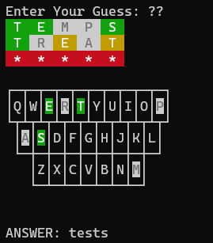

# Wordle (PHP)

My implementation of Wordle in PHP.

Features:
 - Unlimited tries!
 - A global Daily random word synced to UTC
 - Random words of 4 to 9 letters
 - Tell your friends about word #123 of 5 letters for them to try!

## Usage

If git cloning, use `bin/wordle`, if installing globally use `wordle`.

### Daily Word
Command: `wordle`

Will get the daily word without internet access. The daily word is generated using a seeded random number, the seed will be the current date in UTC.

### Random Words
Command: `wordle LENGTH`

Replace LENGTH with any number between 4 and 9 (inclusive).

This is entirely random.

When you're done, it will tell you which number word you did, so your friends can try.

### Specific word
Command: `wordle LENGTH WORD_NUMBER`

Like the last command, replace LENGTH with any number between 4 and 9 (inclusive).

If your friend has tried word #123, you can replace WORD_NUMBER with this to use try the same word!

### Cheating

Make no mistake, this is cheating, you cheater!

When wordle asks for a word, you can enter `?` for suggestions and `??` for the answer.

Suggestions are only as good as your guesses, it's limited to 10 results but will tell you if there are more. If you haven't guessed any words yet, it will try and recommend every word.

Cheating will show up on your share code with red question marks (?) for suggestions and red asterisks (*) for full-on cheating.

Try not to use this, but I know how annoying it is when you can't solve a wordle but never find out the answer, now you can!

THIS WILL NOT HELP YOU CHEAT ON OTHER VERSIONS OF WORDLE.

## Installation

`composer global require adamhebby/wordle-php`

Then you can run `wordle` from anywhere, assuming you have composer in your path.
